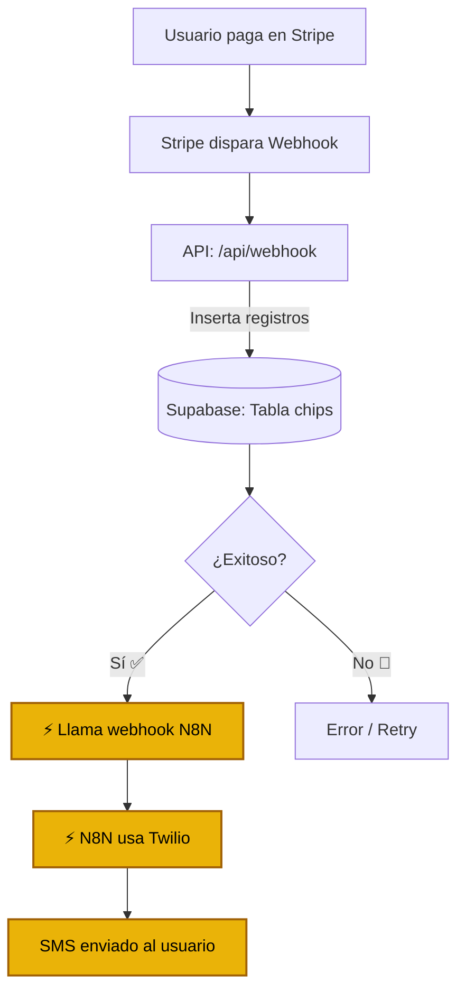
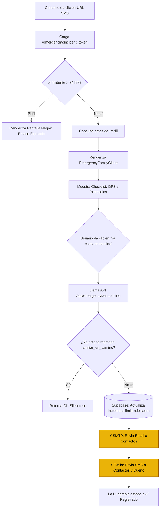
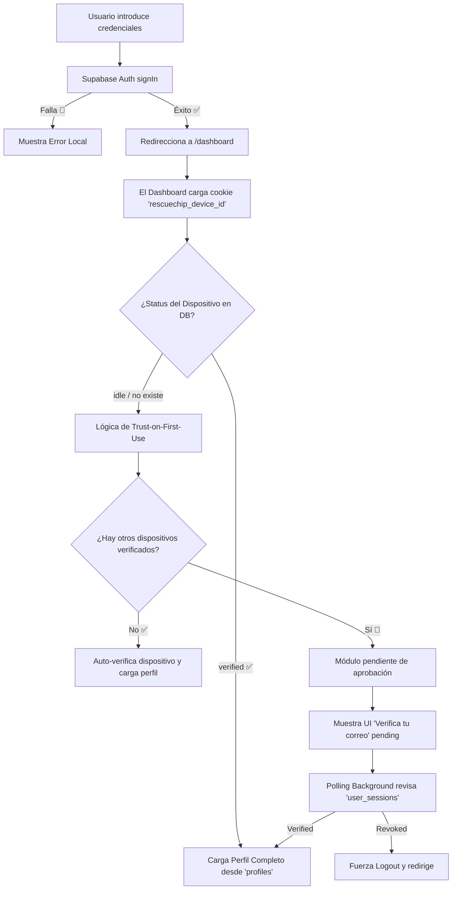
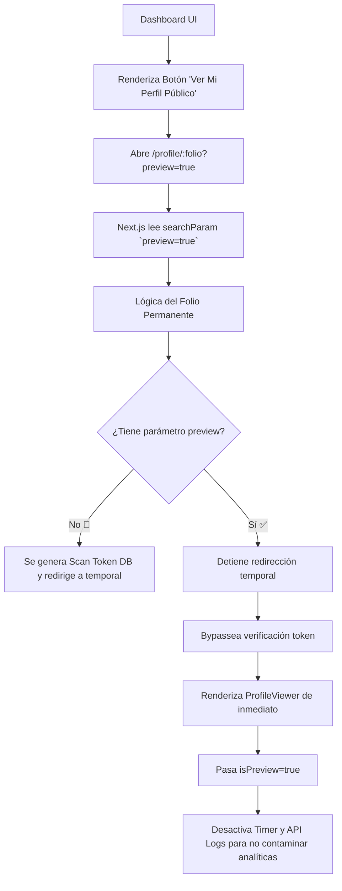

# FLUJOS DEL SISTEMA RESCUECHIP

La siguiente documentación técnica mapea los flujos principales del sistema RescueChip a partir del análisis del código fuente.

---

## Índice de Flujos
1. Flujo de Compra
2. Flujo de Activación de Chip
3. Flujo de Escaneo (Emergencia / Consulta)
4. Flujo de Interacción de Familiares
5. Flujo de Login y Verificación de Dispositivo
6. Flujo de Preview desde Dashboard
7. Tabla de Condicionantes

---

## 1. Flujo de Compra
*(Proceso a nivel lógico basado en la arquitectura de Webhooks de RescueChip)*



---

## 2. Flujo de Activación de Chip
**Archivos:** `middleware.ts`, `src/app/activate/page.tsx`, `src/app/api/activate/validate/route.ts`

- **Condicionantes:** `folio`, `chip.status`, `chip.activated`
- **APIs llamadas:** `/api/activate/validate` (GET), `Supabase Auth`, `N8N` (POST)
- **Redireccionamientos:** `ProfileViewer` (si ya está activado o en validación inicial fallida donde sea requerido), `Dashboard` (éxito).

```mermaid
flowchart TD
    A[Usuario entra a /activate?folio=RSC-XXX] --> B(Middleware: Rate Limit)
    B -- Excede 🔴 --> C[Bloqueo 429 Limit]
    B -- Pasa ✅ --> D[Frontend: llama /api/activate/validate]

    D --> E{¿Estado en Supabase?}
    
    E -- "status == 'activado' o activated == true" 🔴 --> F[Redirige a /profile/RSC-XX]
    E -- "status == 'disponible'" o "status == 'vendido'" ✅ --> G[Muestra Formulario de Activación]
    E -- No existe 🔴 --> H[Muestra Error UI]

    G --> I[Usuario Llena Formulario y Submit]
    I --> J{¿Tiene cuenta?}
    
    J -- No --> K[Supabase Auth: signUp]
    J -- Sí --> L[Supabase Auth: signInWithPassword]
    
    K --> M{¿Ya tiene otro\nchip vinculado?}
    L --> M
    
    M -- Sí 🔴 --> N[Muestra Modal: ¿Vincular o Otra Persona?]
    N -- Vincular --> O[Actualiza Chip apuntando a profile existente]
    N -- Otra persona --> P[Fuerza Logout y pide nuevo email]
    
    M -- No ✅ --> Q[Inserta Profile Nuevo]
    Q --> R[Actualiza Chip: activado = true]
    
    R --> S[⚡ Dispara Webhook N8N de Registro]
    O --> S
    S --> T[Redirige a /dashboard]

    classDef success fill:#4ade80,stroke:#166534,stroke-width:2px,color:#000;
    classDef error fill:#f87171,stroke:#991b1b,stroke-width:2px,color:#fff;
    classDef external fill:#eab308,stroke:#a16207,stroke-width:2px,color:#000;
    
    class S external;
    class T,F,H success;
```

---

## 3. Flujo de Escaneo de Emergencia
**Archivos:** `src/app/profile/[id]/page.tsx`, `src/components/ProfileViewer.tsx`, `src/app/api/log-access/route.ts`

- **Condicionantes:** `isDemo`, `isEmergency`, `tokenTimeLeft`
- **APIs llamadas:** `/api/log-access` (Emergencia vs Consulta)
- **Servicios:** ⚡ Nodemailer (SMTP), ⚡ Twilio (SMS/WhatsApp)

```mermaid
flowchart TD
    A[NFC o QR escaneado] --> B[Entra a /profile/:folio]
    
    B --> C{¿Manejo Especial?}
    C -- id == 'DEMO' o 'RSC-001' --> D[Carga datos dummy y renderiza]
    C -- Folio Permanente (RSC-XXX) --> E[Verifica si está activado]
    
    E -- No activado 🔴 --> F[Redirige a /activate?folio=XXX]
    E -- Activado ✅ --> G[Supabase: Crea Scan Token temporal]
    G --> H[Redirige a /profile/:token_temporal]
    
    H --> I[Usuario abre URL con Scan Token]
    C -- Token (32 chars) --> I
    
    I --> J{¿Token expirado?}
    J -- Sí 🔴 --> K[Muestra UI de Expiración]
    J -- No ✅ --> L[Carga Perfil Real y entra a ProfileViewer]
    
    L --> M[Aparece Modal de Consentimiento Médico]
    M --> N{¿Qué modo elige?}
    
    N -- Modo Consulta --> O[Muestra UI Censurada y desactiva botones]
    O --> P[Llama /api/log-access (tipo: consulta)]
    
    N -- Modo Emergencia --> Q[Muestra UI Completa y Timer de 7 min]
    Q --> R[Llama /api/log-access (tipo: emergencia)]
    
    R --> S[(Supabase)]
    S -->|Guarda en| T[chip_accesos]
    S -->|Genera Token Incidente en| U[incidentes]
    
    U --> V[⚡ Envía Email SMTP a owner/contactos]
    V --> W[⚡ Envía SMS/WhatsApp vía Twilio]

    classDef success fill:#4ade80,stroke:#166534,stroke-width:2px,color:#000;
    classDef error fill:#f87171,stroke:#991b1b,stroke-width:2px,color:#fff;
    classDef external fill:#eab308,stroke:#a16207,stroke-width:2px,color:#000;
    
    class V,W external;
```

---

## 4. Flujo de Página de Familiares
**Archivos:** `src/app/emergencia/[token]/page.tsx`, `src/app/api/emergencia/en-camino/route.ts`

- **Condicionantes:** Expiración a las 24 horas (`incidente.expires_at`), bandera `familiar_en_camino`



---

## 5. Flujo de Login y Verificación de Dispositivo
**Archivos:** `src/app/login/page.tsx`, `src/app/dashboard/page.tsx`

- **Tablas:** `user_sessions`, Auth
- **Concepto:** Zero-friction verification logic (auto-aprobar dispositivos si el usuario mete clave por primera vez).



---

## 6. Flujo de Preview desde Dashboard
**Archivos:** `src/app/dashboard/page.tsx`, `src/app/profile/[id]/page.tsx`



---

## 7. Tabla de Condicionantes

| Condicionante | Origen / Variable | Descripción Lógica | Flujo Afectado |
| :--- | :--- | :--- | :--- |
| **`chip.status`** | DB: `chips` | Si no es `disponible` ni `vendido` rechaza la activación nueva. | Activación (`validate/route.ts`) |
| **`chip.activated`** | DB: `chips` | Si es `true`, prohíbe el registro para evitar sobreescritura de dueños. | Activación |
| **`isDemo`** | Frontend y URL | Si `id` es `RSC-001` o `DEMO`, inyecta perfil estático forzadamente falso, no cuenta analytics y salta DB real. | `ProfileViewer` / `[id]/page.tsx` |
| **`isPreview`** | Dashboard URL param | Evita el token temporal. Anula las llamadas a `/api/log-access` (no hay notificaciones de emergencia reales). | `[id]/page.tsx` / `ProfileViewer` |
| **`isEmergency`** | Consentimiento UI | Controla si la data médica se despliega completamente o si oculta datos accionables y teléfonos (Modo Consulta / Modo Emergencia). | `ProfileViewer` |
| **`tokenTimeLeft`** | Token `expires_at` | Fuerza bloqueo negro de UI a paramédicos al llegar a cero (re-autenticación obligatoria). | `ProfileViewer` / Timeout |
| **`perfil_compartido`** | DB: `chips` | Informa al usuario en el Dashboard que su chip está atado a la cuenta madre de alguien más. | `Dashboard` |
| **`familiar_en_camino`** | DB: `incidentes` | Cambia la UI de familiares para prohibir llamadas redundantes de SMS y correos si el evento ya se cubrió. | `EmergencyFamilyClient` |
